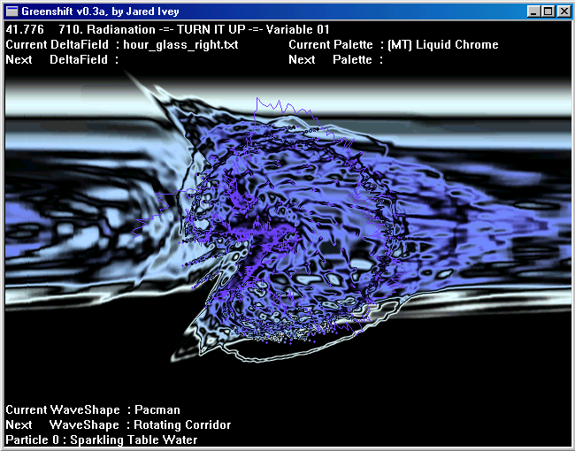
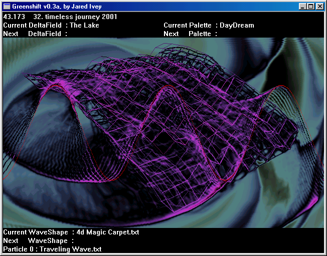
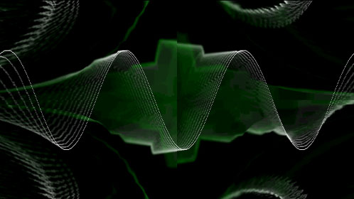

)

A free, open-source Winamp visualization plugin designed to graph four-dimensional mathematical functions at high speed while offering greater flexibility than comparable visualizers.

## Overview

Greenshift was designed to achieve the performance of Geiss without resorting to assembly, and aims to surpass G-Force with smooth transitions between effects,
more palettes, and greater extensibility. It is a C++ project that provides a powerful engine for generating dynamic particle and wave visualizations,
extended via user-defined mathematical expressions stored in external config files.

## Key Features

* **4D Function Graphing:** Supports $y(x, z, t)$ where the third parameter is time, allowing for dynamic spatial-temporal visualizations.
* **Mathematically Rich Syntax:** Supports complex mathematical expressions, including hyperbolic trigonometric functions.
* **Dynamic Expression Engine:** Allows for an infinite range of behaviors extended via user-defined formulas in external text files, evaluated in real-time without recompilation.
* **Color Space Support:** Built-in support for RGB, HSV, HLS, CMY, CMYK, and OKLab palettes.
* **Efficient Rendering:** Designed to maintain high framerates while smoothly transitioning between precalculated delta fields — the code that moves every pixel on the screen.

## Controls (Hotkeys)

| Key | Action |
| :--- | :--- |
| `D` | Toggle display text |
| `F` | Toggle framerate display |
| `Esc` | Close Greenshift |
| `Alt + Enter` / Double Click | Toggle fullscreen |
| `1` | Force CPP only implementation (least optimizations) |
| `2` | Force x86 assembly optimization (uses MMX intrinsics in 32bit color; MAY CRASH if unsupported) |
| `3` | Force MMX assembly optimization (only in 32bit color; MAY CRASH if unsupported; experimental non-MMX implementation in 8/16bit color) |
| `4` | Force SSE assembly optimization (currently hard coded to call the MMX implementation) |

## Performance

Greenshift is primarily written in C++20, with a small amount of C. MMX assembly is used for selected performance-critical operations. At runtime, Greenshift detects the available instruction sets and selects an appropriate implementation:

- Portable C++ implementations are used as fallbacks when optimized instruction sets are unavailable.
- A compiler-tuned x86 implementation uses carefully structured C++ code designed to encourage more efficient machine-code generation. Its inner loop was refined through extensive repeated benchmarking rather than by writing x86 assembly directly, retaining changes only when they produced measurable speedups.
- MMX-optimized routines are used when supported, particularly for integer color-processing operations.
- The current SSE path calls the MMX implementation rather than using dedicated floating-point SSE instructions.

MMX is well suited to Greenshift's integer-based color-processing workloads, while SSE is primarily designed for floating-point operations.

## Getting Started

* **Platform:** Windows.
* **Usage:** Primarily used as a Winamp visualization engine.

## About this project's development

### The Name ""
The name was inspired by a technical quirk discovered during development. When working in 16-bit color (5 bits Red, 6 bits Green, 5 bits Blue), repeatedly averaging the color channels of adjacent pixels leads to precision loss. Because green has one more bit of precision, it stays brighter slightly longer—causing a shift toward the green "end" of the spectrum. I dubbed this phenomenon "greenshift," and the name has stuck ever since.

### Design Philosophy: Preserving the "Feel"

The design philosophy behind Greenshift centers on an attempt to preserve the visual and behavioral "feel" of its configs, regardless of the hardware or system settings. This approach focuses on decoupling the artistic output from the technical implementation so that system upgrades don't fundamentally alter the character of the art. This includes using normalized ranges to maintain composition across various resolutions, narrowing precision during the RNG seeding process to keep random behaviors consistent when moving between 32-bit and 64-bit math, and normalizing line widths so that drawing scales naturally with screen resolution. The intent is that the character of each visualization remains stable and recognizable, even as system parameters are changed or improved.

## Project History

The original concept, dating to 1998, was a 4D graphing tool intended for use as a
screensaver. By the time serious design work began in 2000, the vision had evolved;
it was reimagined as a Winamp visualization plugin from the outset of design, with
formal implementation beginning in 2001.

Greenshift began with a long-standing concept for graphing four-dimensional
mathematical functions using X, Y, Z, and T. An initial attempt to prototype
the `Expression` class in C++ proved difficult because C++ is a strongly typed
language, which made it challenging to explore the object relationships and
class hierarchy I had envisioned. I therefore pursued a detour through
[Smalltalk-80](https://en.wikipedia.org/wiki/Smalltalk), a weakly typed language,
where I developed and tested the design in a more flexible environment.

That detour provided time to refine the graphing system, listen to music while
watching Winamp visualizations, and recognize that I could create one myself
using the `Expression` class as its foundation. The original screensaver concept
was consequently reframed before the Greenshift design phase began. I then
spent several semesters designing the project in a physical notebook between
college lectures, working through its architecture, rendering model,
expression system, configurable effects, and performance goals before beginning
the C++ implementation.

Greenshift is the convergence of two ideas: the symbolic graphing of
four-dimensional mathematical functions and the creation of a Winamp
visualization. Those ideas were combined during the design phase, before
Greenshift's substantive implementation began, and the project was designed
from the ground up around both.

### Related Projects

#### Predecessor Projects

Greenshift directly grew out of [`4D Symbolic Function Graphing`](https://github.com/redgreenshift/4d-symbolic-function-graphing),
which was itself part of a direct lineage from [`XYZ`](https://github.com/redgreenshift/XYZ),
an earlier project for three-dimensional function graphing.

The `4D Symbolic Function Graphing` project was where I developed the design for
the `Expression` class hierarchy. I first implemented and tested that design in
[Smalltalk-80](https://en.wikipedia.org/wiki/Smalltalk), whose more flexible
type system made it easier to explore the object relationships and refine the
hierarchy. Once the design was functional, I implemented it in C++, where
working from an already-established design made the strongly typed language
much easier to work with.

The `Expression` hierarchy is central to Greenshift. It allows user-defined
mathematical functions to be represented and evaluated symbolically, forming the
foundation for Greenshift's configurable expression engine. The project expanded
around that foundation to support real-time visualization, color processing,
efficient rendering, and transitions between visual effects.

The original name for Project Greenshift was “expressionconsole,” reflecting the central role of this technology.

#### Successor Projects

[`FireDemo`](https://github.com/redgreenshift/firedemo) is a looser successor to Greenshift. It carries forward ideas including `BitCanvas`, frame-to-frame decay values, and configurable color palettes, while exploring a broader range of real-time lighting effects.

## AI Policy

  

Contributions from AI agents are welcome, provided they are reviewed by a
human before being committed. Every change MUST be approved by a real person;
approval by an automated process or another AI agent alone is insufficient.

AI tools may be used to suggest code ideas or help draft comments, but all
code is reviewed by the project author before committing. Code that the
author does not fully understand is not committed.

## License

Greenshift is free software; you can redistribute it and/or modify it under the terms of the GNU General Public License as published by the Free Software Foundation; version 2 only.

Greenshift is distributed in the hope that it will be useful, but WITHOUT ANY WARRANTY; without even the implied warranty of MERCHANTABILITY or FITNESS FOR A PARTICULAR PURPOSE.  See the GNU General Public License for more details.

You should have received a copy of the GNU General Public License along with this program; see [`LICENSE`](LICENSE).

Greenshift uses the MersenneTwister library (Richard J. Wagner), which is licensed separately under the GNU Lesser General Public License, version 2.1 (or later). See <a href="MersenneTwister.h">`MersenneTwister.h`</a> and <a href="licenses/LGPL-2.1-or-later.txt">`licenses/LGPL-2.1-or-later.txt`</a> for details.

---

## Contact & Links

* [GitHub Repository](https://github.com/redgreenshift/greenshift)
* [Website](http://greenshift.net)
* **Author:** [Jared Ivey](mailto:jared.ivey+greenshift@outlook.com)
